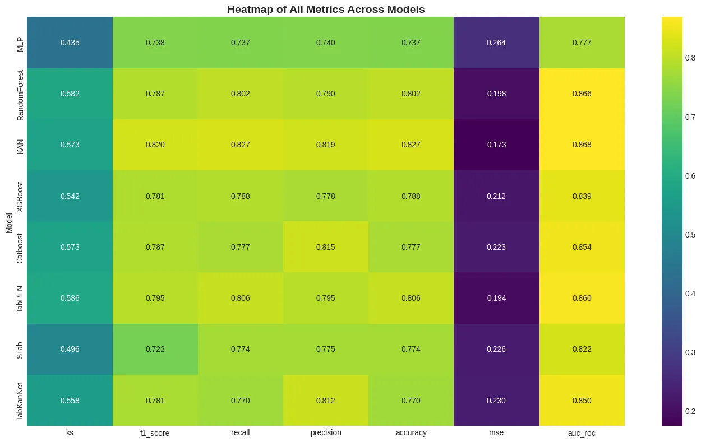

# churn-prediction
Testing neural and tree ML algorithms on a [customer Churn dataset](https://www.kaggle.com/datasets/kapturovalexander/customers-churned-in-telecom-services/data).

The notebook includes data preparation, data separation, training and tests with the following algorithms:
- MLP
- Random Forest
- KAN
- XGBoost
- CatBoost
- STab
- TabKANet
- TabPFN

We used Optuna + cross validation for most of the algorithms, reaching a 0.586 KS statistic and 0.86 AUC ROC using TabPFN:

Contributors: [Fábio Papais](https://github.com/fabiopapais), [Jaubert Gualberto](https://github.com/jaubertgualberto) and [Silvânio Assunção](https://github.com/silvanio45)
